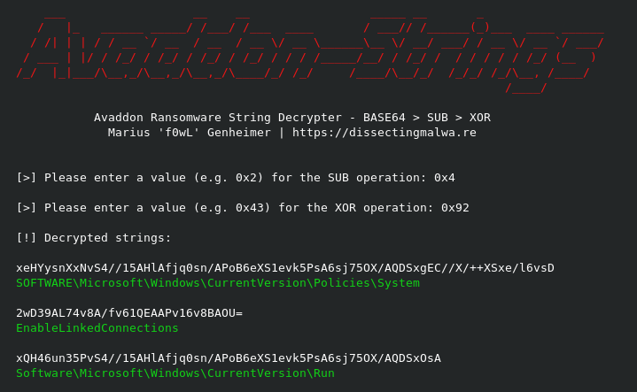
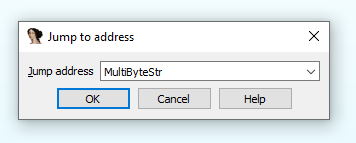
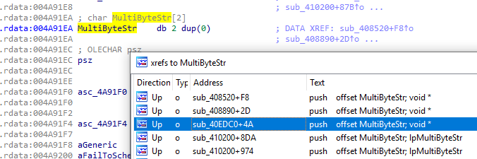
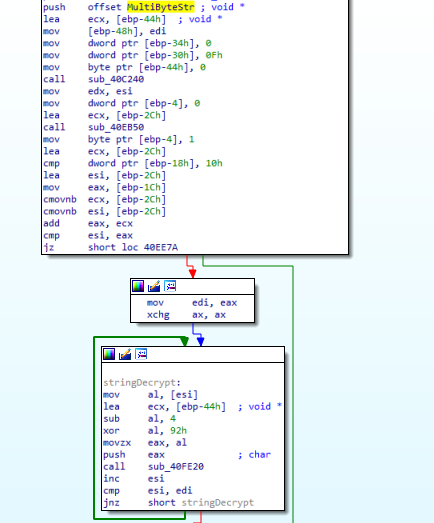

# avaddon-strings
String Decrypter for Avaddon Ransomware

  

 

## How it works

 

Running 'strings' on an Avaddon Binary will present you with ~80 Base64 encoded strings. Since decoding will only yield garbled data we first have to work out the "encryption" scheme. Currently the values needed to decrypt the strings need to be extracted manually. To do this with IDA just follow these steps:

This is kind of a hack, but jumping to MultiByteStr will get you there fastest :D

  

 

Press X to bring up the cross-references and have a look around.

  

 

At the time of writing this most samples have a routine looking similar to the screenshot below. Look for a SUB followed by an XOR operation. After you got that done just plug the values into the script and supply the encrypted strings in a text file to test it out.

  

 

As of yesterday (25.06.2020) there seem to be samples with a different confusion/encryption technique and I'm looking forward to updating this script :)

 

| Sample SHA-256                                                    | SUB  | XOR  |
| ----------------------------------------------------------------- | ---- |------|
| 05af0cf40590aef24b28fa04c6b4998b7ab3b7f26e60c507adb84f3d837778f2  | 0x2  | 0x43 |
| 6616abb725c24307f4f062996edc5150079bc477acd4236a4f450e5835a20c62  | 0x2  | 0x43 |
| 4f198228806c897797647eecce0f92d4082476b82781183062a55c417c0bb197  | 0x2  | 0x43 |
| fa4626e2c5984d7868a685c5102530bd8260d0b31ef06d2ce2da7636da48d2d6  | 0x4  | 0x92 |
| 75066a2982794eff05bb053ba53e7a018faa0b6151f8a47b35f4153e9e5c74ad  | 0x9  | 0x84 |
| 4a072c044993616658d1fdeddcf9ead501633fdf000cde18447301afa9b96e99  | 0x5  | 0x9B |

  

All of the tested samples are available on Any.run
